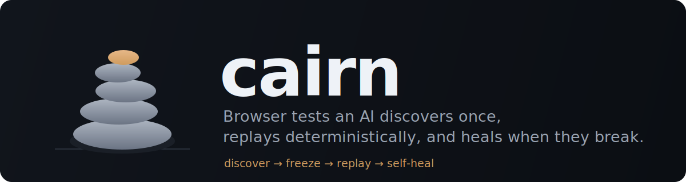

# cairn



[](https://www.npmjs.com/package/cairn-engine)
[](https://github.com/team-poem/cairn/actions/workflows/ci.yml)
[](https://www.npmjs.com/package/cairn-engine)
[](LICENSE)

**An AI writes your browser test once — then it runs forever with no AI at all, and heals itself when the UI changes.**

An AI walks your app **once** to discover the flow and **freezes** it. From then on it replays
**deterministically — no LLM, no hand-written selectors.** When the UI changes and a step breaks,
the AI returns to **heal just that step**, then re-freezes.

> A **cairn** is a stack of stones that marks a trail — built once, so the path can be found
> again. That's the whole idea: find the path once, follow the marker forever, rebuild it when the
> trail shifts.

cairn is an **engine, not a product** — a model- and browser-agnostic core (`cairn-engine`) you
**embed** to build QA tools, CI gates, or monitors. It's _general in mechanism, specific in
meaning_: the core knows no app; you supply what "success" means and how to drive the browser.

## Why cairn

It sits in the gap between two things people already reach for — and don't love:

| | Scripted (Playwright/Cypress) | LLM browser agents | **cairn** |
| --- | :---: | :---: | :---: |
| **Authoring** | hand-written selectors & code | plain language | **plain language** |
| **Every run** | deterministic, cheap | LLM in the loop — slow, costly, flaky | **deterministic, cheap** |
| **UI changes** | you fix the selectors | re-reasons, may drift | **self-heals, then re-freezes** |
| **LLM calls** | none | every run | **once to discover · again only to heal** |

You don't maintain selectors, and you don't pay an LLM on every CI run. **Discovery is paid once;
regression is free.**

## The loop

```
intent ─► discover (LLM, once) ─► cart.skill.json ─► replay (no LLM, forever)
                                                          │ a step breaks
                                                          ▼
                                                  self-heal (LLM, just that step)
```

- **discover** _(LLM · once)_ — observes the live page, picks one action, acts, and repeats until your intent is met. Out comes a `Scenario`.
- **freeze** — that scenario is plain JSON (`*.skill.json`): a flat list of steps + assertions, each target carrying several locators. No model, no LLM — just data.
- **replay** _(no LLM)_ — runs the steps through a `Driver`, auto-waiting for the page to settle; a `Critic` rules on three layers of evidence — _did it act_ · _what it looked like_ · _the requests & console_. Same input, same verdict.
- **heal** _(LLM · only on a break)_ — when a target stops resolving or the outcome diverges, the LLM maps your original step `intent` onto the new page, repairs that one step, retries, and returns a scenario to re-freeze. A green replay never calls it.

**Measured, not claimed** — a real multi-step checkout, via cairn's [`bench/`](bench):

- **4/4 deterministic** replays · **0 LLM calls** on replay
- discovery **~$0.50 once** → every replay after is **$0** (a full LLM agent runs **~$15–30 _per run_**)
- a renamed button broke hand-written selectors; cairn **healed it and stayed green**

## Use it

```sh
npm install cairn-engine
```

**Author once** — an AI discovers the flow; you freeze it to a file:

```ts
import { discover, ChromeDevToolsDriver, createLlmClient, saveSkillFile } from "cairn-engine";

const scenario = await discover("log in, add the first product, open the cart", {
  driver: new ChromeDevToolsDriver(),
  llm: createLlmClient(), // Claude Code if installed, else a provider key (below)
  baseUrl: "https://shop.example",
});
await saveSkillFile("cart.skill.json", scenario);
```

**Replay forever** — deterministic, no LLM. When the UI drifts, `heal` repairs the step and you
re-freeze the fixed path:

```ts
import { runScenario, loadSkillFile, saveSkillFile } from "cairn-engine";

const scenario = await loadSkillFile("cart.skill.json");
const { result, healedScenario } = await runScenario(scenario, {
  heal: true, // repair a broken step with the LLM instead of going red
});

if (healedScenario) {
  // the UI changed and cairn adapted — write the repaired path back
  await saveSkillFile("cart.skill.json", healedScenario);
}
if (!result.verdict.passed) process.exit(1); // a deterministic gate for CI
```

Prefer the terminal? The same steps are CLI commands —
`cairn discover … --freeze cart.skill.json` · `cairn replay cart.skill.json` · `… --heal`.

**Models** — set a key and cairn picks the backend: **Anthropic** (`ANTHROPIC_API_KEY`, or a local
**Claude Code** install with no key), **OpenAI** (`OPENAI_API_KEY`), or **Gemini**
(`GEMINI_API_KEY`). Force one with `createLlmClient({ backend: "openai" })`, or implement the
`LlmClient` port for any other model. The default browser driver is **Chrome DevTools MCP**,
launched automatically.

## A frozen scenario is just data

`*.skill.json` is a flat, readable, diffable list of steps + assertions — no code, no model:

```json
{
  "name": "cart",
  "steps": [
    { "kind": "goto", "url": "https://shop.example" },
    { "kind": "type", "target": { "text": "Email" }, "text": "you@shop.example" },
    {
      "kind": "click",
      "target": { "text": "Log in" },
      "intent": "submit the login form",
      "expect": { "requestStatus": { "urlIncludes": "/auth", "status": 200 } }
    },
    { "kind": "click", "target": { "text": "Add to cart" } },
    { "kind": "click", "target": { "text": "Cart", "role": "link" } },
    { "kind": "waitFor", "until": { "url": "/cart" } }
  ],
  "assertions": [
    { "kind": "navigated", "to": "/cart" },
    { "kind": "no-failed-requests" }
  ]
}
```

Each `target` keeps several locators — `text` (accessible name) first, `role` + `index` as a
rename-resilient fallback, `selector` as a CSS escape hatch — which is what lets replay survive a
redesign without falling back to the LLM. A step's `expect` is its post-condition: replay checks
it deterministically and only heals if it diverges.

## How it works — one pipeline, six ports

The execution body is a five-stage pipeline. No environment- or domain-specific logic lives inside
it — every variable behavior arrives through an interface.

```
Context ─► Plan ─► Execute ─► Judge ─► Report
```

- **Context** — assembles grounding (the intent; later: git diff, ticket, docs)
- **Plan** — turns intent into a `Scenario` (an explicit one for replay; an LLM loop for discover)
- **Execute** — drives the browser, auto-waiting for the page to settle
- **Judge** — a **Critic** rules on three layers of evidence, not a screenshot guess:
  `execution` (did it act/navigate) · `perception` (what it looked like) · `logic` (requests, console)
- **Report** — emits the result anywhere (console, JSON, your tracker)

The six extension points — **`ContextProvider · Planner · Driver · SkillStore · Critic ·
Reporter`** — are how you adapt cairn without forking it. The LLM lives behind its own seam
(`LlmClient`), so neither a model nor a browser is hard-wired into the core. Where a whole port is
too much, **`custom` assertions and `actions`** let a product define its own success criteria and
interactions inline — the engine ships defaults, your product defines the specifics.

Two design lines hold the whole thing together:

- **Replay is deterministic.** A frozen scenario replays with no LLM in the loop. The LLM is summoned only to (a) discover a new scenario or (b) self-heal a broken one.
- **Pattern, not data.** The core knows no specific app or environment; everything app-specific is a plugged-in interface implementation.

## Build on it

cairn is made to be **built on**, not scattered across your service as test code. A few things it
powers:

- **A QA tool** — non-developers write flows in plain language, then watch them replay & self-heal
- **A CI regression gate** — frozen flows run on every PR; drift heals instead of going red
- **A synthetic monitor** — replay critical paths against production, alert only when one truly breaks
- **A visual-replay app** — the engine streams per-step progress + screenshots; you draw the UI

You _can_ call `runScenario` straight from a test file — nothing stops you. But that isn't the
point: cairn is **not a Jest or Playwright you write service tests in** — it's the engine those
kinds of tools are built _from_.

## Extend it

Every stage is a replaceable port — bring your own `Driver` (e.g. Playwright), `Critic`,
`Reporter`, `ContextProvider` (auth/fixtures), or `LlmClient` (any model). Compose them directly
with `runHarness`, or define success inline with `custom`:

```ts
import {
  runHarness, StaticPlanner, ChromeDevToolsDriver,
  AssertionCritic, JsonReporter, InlineContextProvider,
} from "cairn-engine";

const result = await runHarness({
  context: new InlineContextProvider(),
  planner: new StaticPlanner(scenario), // replay a frozen scenario
  driver: new ChromeDevToolsDriver(),   // or your own Driver
  critic: new AssertionCritic(),        // or LlmCritic, or your own
  reporter: new JsonReporter("report.json"),
}, scenario.name);
```

Building a UI on top? The engine streams what a screen needs — `signal` (Stop) · `screenshots` ·
`onStep` (live timeline). **No Node** (browser / extension)? Import from `cairn-engine/browser` and
compose `runHarness` with your own `Driver` (e.g. one over `chrome.debugger`).

## Conventions — agentic test files

Name the file that embeds cairn and calls `runScenario(...)` `*.agentic.ts`, paired with its frozen
`*.skill.json`:

```
checkout.agentic.ts     # imports cairn-engine and runs the scenario
checkout.skill.json     # bare Scenario JSON written by discover/freeze
```

The suffix is intentionally distinct from `*.test.ts` / `*.spec.ts` (ordinary unit/e2e tests),
marks the agentic tier, and gives tooling a stable glob: `**/*.agentic.ts`.

## Structure

Ports & adapters (hexagonal): `core/` is the pure domain and the ports; `adapters/` implements
them. Dependencies point inward — adapters depend on core, never the reverse.

```
cairn/
├── packages/
│   └── harness/                  # cairn-engine — the engine
│       └── src/
│           ├── core/             # domain + ports (depends on nothing else)
│           │   ├── types.ts        # Context · Scenario · Evidence · Verdict …
│           │   ├── ports.ts        # the extension points (interfaces)
│           │   ├── pipeline.ts     # Context → Plan → Execute → Judge → Report
│           │   └── discover.ts     # the LLM discover loop (the only loop)
│           ├── adapters/         # port implementations (the things you plug in)
│           │   ├── drivers/        # ChromeDevTools (MCP) · self-heal · fake
│           │   ├── critics/        # deterministic assertions · LLM
│           │   ├── reporters/      # console · json
│           │   ├── llm/            # Claude Code · Anthropic · OpenAI · Gemini · factory
│           │   └── context/ · planners/ · skills/
│           ├── run.ts            # composition: runScenario with defaults
│           ├── index.ts          # public API
│           └── cli.ts            # thin CLI over the library
├── docs/design.md               # the design, in full
└── spec/                        # architecture invariants + living state
```

## Status & what's next

`cairn-engine` is on npm. The full loop — **discover → freeze → replay → self-heal** — works today
and is benchmarked: deterministic, LLM-free replay on real multi-step flows; discovery paid once
(~$0.5) against $0 replays; survival across UI renames without re-reasoning. Multiple LLM backends
(Anthropic, OpenAI, Gemini) and a browser/extension entry ship in the box.

What's next sits **above** the engine: input sources (git diff / ticket `ContextProvider`s), and a
separate desktop app that embeds it for visual replay. The interfaces are the contract.

## Contributing

cairn takes pull requests — see [`CONTRIBUTING.md`](CONTRIBUTING.md) for the workflow (Conventional
Commits, an issue link per PR, the `spec/architecture.md` invariants) and [`docs/design.md`](docs/design.md)
for the full design.

## License

[MIT](LICENSE).
