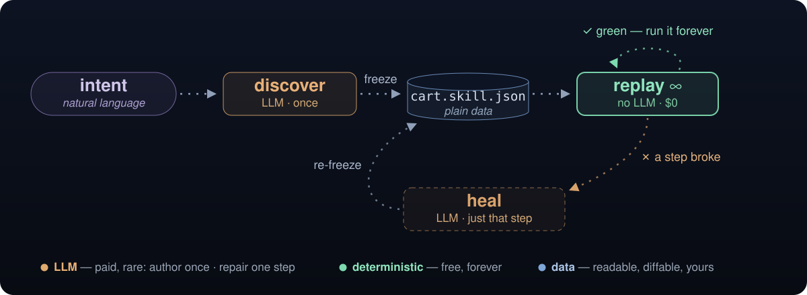

# cairn



[](https://www.npmjs.com/package/cairn-engine)
[](https://github.com/team-poem/cairn/actions/workflows/ci.yml)
[](https://www.npmjs.com/package/cairn-engine)
[](LICENSE)

**An AI writes your browser test once — then it runs forever with no AI at all, and heals itself when the UI changes.**

An AI walks your app **once** to discover the flow and **freezes** it. From then on it replays
**deterministically — no LLM, no hand-written selectors.** When the UI changes and a step breaks,
the AI returns to **heal just that step**, then re-freezes.

> A **cairn** is a stack of stones that marks a trail — built once, so the path can be found
> again. That's the whole idea: find the path once, follow the marker forever, rebuild it when the
> trail shifts.

cairn is an **agentic-testing engine** — an engine, not a product: a model- and browser-agnostic
core (`cairn-engine`) you **embed** to build QA tools, CI gates, or monitors. It's _general in mechanism, specific in
meaning_: the core knows no app; you supply what "success" means and how to drive the browser.

## See it

Pay the LLM once to author; replay is free, forever:

```console
$ cairn discover "log in and open the cart" --url=https://shop.example --freeze=cart.skill.json
discovering with anthropic:claude-sonnet-4-6 …

discovered scenario "log in and open the cart" — 6 steps:
  · {"kind":"goto","url":"https://shop.example"}
  · {"kind":"type","target":{"text":"Email","role":"textbox","index":0},"text":"you@shop.example"}
  · {"kind":"click","target":{"text":"Log in","role":"button","index":0},"intent":"submit the login form"}
  ⋮

frozen → cart.skill.json  (replay with: cairn replay cart.skill.json)

$ cairn replay cart.skill.json
replaying frozen skill "log in and open the cart" — deterministic, no LLM

log in and open the cart
  ✓ navigated → https://shop.example/cart
  · 6 actions · 34 requests · 0 console msgs
  · llm: 0 call(s)
  ✓ no-failed-requests
  ✓ navigated — https://shop.example/cart
  ✓ request-status — 200 https://shop.example/api/auth

✓ pass — 3 assertion(s)
```

That second command is your regression suite now: same input, same verdict, **zero LLM calls** —
and the report prints the proof itself (`· llm: 0 call(s)`; `result.usage` in the library). Run it
on every push for free.

## Why cairn

It sits in the gap between two things people already reach for — and don't love:

| | Scripted (Playwright/Cypress) | LLM browser agents | **cairn** |
| --- | :---: | :---: | :---: |
| **Authoring** | hand-written selectors & code | plain language | **plain language** |
| **Every run** | deterministic, cheap | LLM in the loop — slow, costly, flaky | **deterministic, cheap** |
| **UI changes** | you fix the selectors | re-reasons, may drift | **self-heals, then re-freezes** |
| **LLM calls** | none | every run | **once to discover · again only to heal** |

That middle column has a name now — **agentic testing**: agent-authored, agent-healed, and
deterministic where it counts. You don't maintain selectors, and you don't pay an LLM on every
CI run. **Discovery is paid once; regression is free.**

**Measured, not claimed** — a real multi-step checkout, via cairn's [`bench/`](bench):

- **4/4 deterministic** replays · **0 LLM calls** on replay
- discovery **~$0.50 once** → every replay after is **$0** (a full LLM agent runs **~$15–30 _per run_**)
- a renamed button broke hand-written selectors; cairn **healed it and stayed green**

## The loop



- **discover** _(LLM · once)_ — observes the live page, picks one action, acts, and repeats until your intent is met. Out comes a `Scenario`.
- **freeze** — that scenario is plain JSON (`*.skill.json`): a flat list of steps + assertions, each target carrying several locators. No model, no LLM — just data.
- **replay** _(no LLM)_ — runs the steps through a `Driver`, auto-waiting for the page to settle; a `Critic` rules on three layers of evidence — _did it act_ · _what it looked like_ · _the requests & console_. Same input, same verdict.
- **heal** _(LLM · only on a break)_ — when a target stops resolving or the outcome diverges, the LLM maps your original step `intent` onto the new page, repairs that one step, retries, and returns a scenario to re-freeze. A green replay never calls it. The loop **closes**: a healed path is frozen again, so the next replay is back to zero LLM calls.

## Try it in 60 seconds

You need **Node ≥ 20**, **Chrome**, and a model — an `ANTHROPIC_API_KEY` / `OPENAI_API_KEY` /
`GEMINI_API_KEY`, or no key at all with a local **Claude Code** or **Codex CLI** install. The
browser is driven via Chrome DevTools MCP, launched automatically.

```sh
npm install -g cairn-engine

cairn discover "log in and open the cart" --url=https://your.app --freeze=cart.skill.json
cairn replay cart.skill.json            # deterministic — exit 1 on failure, a ready CI gate
cairn replay cart.skill.json --heal     # UI drifted? repair the broken step and re-freeze
```

Long flows and slow apps have knobs: `discover --max-steps=30` raises the exploration step cap,
and `replay --expect-timeout=5000` gives a step's post-condition more time (ms) before it counts
as diverged — the CLI names for the library's `maxSteps` / `expectTimeoutMs`. And
`discover --semantic` lets the freeze carry LLM-judged `expect` checks for outcomes no
mechanical assertion captures; the trade-off is that replay then needs an LLM critic for those
checks (everything else stays deterministic), so leave it off unless you need it.

## Explore it — freeze-less UX survey

`discover` builds a test; `explore` files a report. Give it a **charter** instead of an intent and
the same loop wanders your app looking for what would annoy a real user — nothing is frozen:

```sh
cairn explore "survey checkout and the account pages for UX problems" \
  --url=https://your.app --report=findings.md    # exit 1 on error-severity findings
```

Findings are derived mechanically from each action's observation delta — **failed requests**,
**console errors**, **dead controls** (a click that changed nothing), **action errors**, **slow
settles** — plus problems the exploring model itself records (a confusing state, a dead end).
The markdown report groups them by severity with the reproduction steps appended. From the
library: `explore(charter, { driver, llm, baseUrl })` returns an `ExploreReport`;
`renderExploreReport(report)` renders it.

## Embed it

The CLI is a convenience; the engine is the point. **Author once** — an AI discovers the flow; you
freeze it to a file:

```ts
import { discover, ChromeDevToolsDriver, createLlmClient, saveSkillFile } from "cairn-engine";

const scenario = await discover("log in, add the first product, open the cart", {
  driver: new ChromeDevToolsDriver(),
  llm: createLlmClient(), // picks a backend from your environment (below)
  baseUrl: "https://shop.example",
});
await saveSkillFile("cart.skill.json", scenario);
```

**Replay forever** — deterministic, no LLM. When the UI drifts, `heal` repairs the step and you
re-freeze the fixed path:

```ts
import { runScenario, loadSkillFile, saveSkillFile } from "cairn-engine";

const scenario = await loadSkillFile("cart.skill.json");
const { result, healedScenario } = await runScenario(scenario, {
  heal: true, // repair a broken step with the LLM instead of going red
});

if (healedScenario) {
  // the UI changed and cairn adapted — write the repaired path back
  await saveSkillFile("cart.skill.json", healedScenario);
}
if (!result.verdict.passed) process.exit(1); // a deterministic gate for CI
```

**Models** — set a key and cairn picks the backend: **Anthropic** (`ANTHROPIC_API_KEY`),
**OpenAI** (`OPENAI_API_KEY`), or **Gemini** (`GEMINI_API_KEY`). No key at all? A local
**Claude Code** install (the default fallback) or the **OpenAI Codex CLI** (reuses your ChatGPT
login) both work key-less. Force one with `createLlmClient({ backend: "codex" })` or the
`CAIRN_LLM_BACKEND` env var, or implement the `LlmClient` port for any other model.

## Run a whole case list — `cairn suite`

Hand cairn your QA cases — natural-language intents plus **your** success criteria — and it
verifies the lot: cached skills replay deterministically; misses are discovered once, frozen
**with your criteria merged in**, and replayed. The first run pays discovery; from the second
run a mechanical-only case costs **zero LLM calls**.

```jsonc
// cases.json
{
  "baseUrl": "https://your.app",
  "cases": [
    { "id": "login", "intent": "log in with the test account" },
    {
      "id": "checkout",
      "intent": "buy 1kg of beans",
      "expect": ["the order total shown is ₩24,000"],
      "assertions": [{ "kind": "request-status", "urlIncludes": "api/pay", "status": 200 }]
    }
  ]
}
```

```sh
cairn suite cases.json --skills ./skills --report suite.md   # exit 1 if any case fails
```

A healed case is re-frozen so the next run is clean again; a truncated discovery fails closed
(nothing frozen, nothing trusted). From the library: `runSuite(cases, opts)` returns per-case
verdicts + whole-suite LLM usage; `renderSuiteReport(result)` renders the markdown summary.

## A frozen scenario is just data

`*.skill.json` is a flat, readable, diffable list of steps + assertions — no code, no model:

```json
{
  "name": "cart",
  "steps": [
    { "kind": "goto", "url": "https://shop.example" },
    { "kind": "type", "target": { "text": "Email" }, "text": "you@shop.example" },
    {
      "kind": "click",
      "target": { "text": "Log in" },
      "intent": "submit the login form",
      "expect": { "requestStatus": { "urlIncludes": "/auth", "status": 200, "method": "POST" } }
    },
    { "kind": "click", "target": { "text": "Add to cart" } },
    { "kind": "click", "target": { "text": "Cart", "role": "link" } },
    { "kind": "waitFor", "until": { "url": "/cart" } }
  ],
  "assertions": [
    { "kind": "navigated", "to": "/cart" },
    { "kind": "no-failed-requests" }
  ]
}
```

Each `target` keeps several locators — `text` (accessible name) first, with `nth` to address
the Nth of several identically-named elements (`{"text": "Accept", "role": "button", "nth": 2}`
is the 3rd Accept button, 0-based), `role` + `index` as a rename-resilient fallback, `selector`
as a CSS escape hatch — which is what lets replay survive a redesign without falling back to the
LLM. A step's `expect` is its post-condition: replay waits
for it deterministically (so an async submit isn't raced) and only heals if it truly diverges.
Each frozen assertion also records its **`origin`** — `user` (your own criterion, merged at
freeze) or `derived` (grounded by the engine from observed evidence) — so a report can say which
greens were verified against *your* spec, not the engine's guess.

> **Text matches one accessibility node at a time.** `text` — in a `target` or a `waitFor` —
> is matched as a substring of a *single* node's accessible name. Text composed at render time
> is often several nodes: JSX interpolation like `팀 명단 ({n}/{cap})` renders as separate
> StaticText nodes, so `waitFor { "text": "팀 명단 (1/3)" }` can never match, even though a
> human "sees" that combined string on screen. Wait on a stable substring that lives in one
> node (here `"팀 명단"`), or fall back to `role`/`selector`.

## The run is just data, too

A frozen scenario is the *test* as data — and a run emits the *execution* as data. Pass a
**`TraceSink`** (the `trace` option on `runScenario` / `runSuite`) and the engine streams its
whole lifecycle as one flat, ordered, versioned sequence of events — watch it live, or store it
and open it in a viewer later:

```jsonc
{ "seq": 7,  "phase": "discover", "kind": "gate",      "payload": { "gate": "ambiguity", "...": "..." } }
{ "seq": 12, "phase": "replay",   "kind": "step",      "stepRef": 3, "payload": { "ok": true } }
{ "seq": 13, "phase": "replay",   "kind": "assertion", "payload": { "passed": true, "origin": "user", "checkedBy": "code" } }
{ "seq": 15, "phase": "heal",     "kind": "heal",      "payload": { "layer": "step", "judgedBy": "original" } }
```

Nothing is silent and nothing is overwritten: what the model decided (and why), what a gate
refused (a policy block, an ambiguity it wouldn't guess through), every assertion labeled by
**who wrote it** (`origin: user | derived`) and **who judged it** (`checkedBy: code | model`),
and every repair as `broke → became` — judged against the *original* assertions, so a heal can
never move the goalposts. Without a sink, no events are even built; a sink that throws can never
change a verdict. The contract is versioned and lives at
[`spec/core/trace.md`](spec/core/trace.md).

Storing it is one import: **`JsonlTraceSink`** appends each event as a line of JSONL (a failed
write is counted, never thrown — recording must not change the verdict), and a step's screenshot
rides along as a sidecar keyed by the event's own `seq`, so even a run that dies mid-way leaves
everything already written readable.

## When the UI changes — self-heal

Say a redesign renames the login button, `Log in` → `Sign in`. A scripted test goes red until
someone fixes the selector. cairn notices the frozen target no longer resolves, asks the LLM to
map the step's recorded *intent* onto the new page, repairs **that one step**, and finishes the
run:

```console
$ cairn replay cart.skill.json --heal --freeze=cart.skill.json
replaying frozen skill "log in and open the cart" — self-heal on

log in and open the cart
  ✓ navigated → https://shop.example/cart
  · 6 actions · 34 requests · 0 console msgs
  · llm: 1 call(s) · 1184 in / 42 out tokens
  ✓ no-failed-requests
  ✓ navigated — https://shop.example/cart
  ✓ request-status — 200 https://shop.example/api/auth

✓ pass — 3 assertion(s)

self-healed 1 step(s):
  · "Log in" → "Sign in"
  re-frozen → cart.skill.json
```

The repaired path is written back — the next replay is deterministic again, with zero LLM calls.
Healing is *surgical*: one step, judged against your original assertions, so a heal can never turn
a genuinely broken flow green.

## How it works — one pipeline, seven ports

The execution body is a five-stage pipeline. No environment- or domain-specific logic lives inside
it — every variable behavior arrives through an interface.

```
Context ─► Plan ─► Execute ─► Judge ─► Report
```

- **Context** — assembles grounding (the intent; later: git diff, ticket, docs)
- **Plan** — turns intent into a `Scenario` (an explicit one for replay; an LLM loop for discover)
- **Execute** — drives the browser, auto-waiting for the page to settle
- **Judge** — a **Critic** rules on three layers of evidence, not a screenshot guess:
  `execution` (did it act/navigate) · `perception` (what it looked like) · `logic` (requests, console)
- **Report** — emits the result anywhere (console, JSON, your tracker)

The seven extension points — **`ContextProvider · Planner · Driver · SkillStore · Critic ·
Reporter · TraceSink`** — are how you adapt cairn without forking it. The LLM lives behind its
own seam (`LlmClient`), so neither a model nor a browser is hard-wired into the core. Where a whole port is
too much, **`custom` assertions and `actions`** let a product define its own success criteria and
interactions inline — the engine ships defaults, your product defines the specifics.

Two design lines hold the whole thing together:

- **Replay is deterministic.** A frozen scenario replays with no LLM in the loop. The LLM is summoned only to (a) discover a new scenario or (b) self-heal a broken one.
- **Pattern, not data.** The core knows no specific app or environment; everything app-specific is a plugged-in interface implementation.

## Build on it

cairn is made to be **built on**, not scattered across your service as test code. A few things it
powers:

- **A QA tool** — non-developers write flows in plain language, then watch them replay & self-heal
- **A CI regression gate** — frozen flows run on every PR; drift heals instead of going red
- **A synthetic monitor** — replay critical paths against production, alert only when one truly breaks
- **A visual-replay app** — the engine streams per-step progress + screenshots; you draw the UI

You _can_ call `runScenario` straight from a test file — nothing stops you. But that isn't the
point: cairn is **not a Jest or Playwright you write service tests in** — it's the engine those
kinds of tools are built _from_.

## Extend it

Every stage is a replaceable port — bring your own `Driver` (e.g. Playwright), `Critic`,
`Reporter`, `ContextProvider` (auth/fixtures), or `LlmClient` (any model). Discovery itself takes
an **`ActionPolicy`** — a deterministic gate that vets each proposed action before it runs (block
destructive controls, cap wandering, stop on a goal) — and a **`perceive`** hook (a
`PerceptionAdapter`) to correct the state of widgets that keep it outside the a11y tree (a custom
checkbox whose selection lives in a styled class, not `aria-checked`), so the model sees the real
state without the engine hacking app-specific DOM. Compose them directly with `runHarness`, or
define success inline with `custom`:

```ts
import {
  runHarness, StaticPlanner, ChromeDevToolsDriver,
  AssertionCritic, JsonReporter, InlineContextProvider,
} from "cairn-engine";

const driver = new ChromeDevToolsDriver(); // or your own Driver
const result = await runHarness({
  context: new InlineContextProvider(),
  planner: new StaticPlanner(scenario), // replay a frozen scenario
  driver,
  critic: new AssertionCritic(),        // or LlmCritic, or your own
  reporter: new JsonReporter("report.json"),
}, scenario.name);
await driver.close(); // whoever constructs a Driver owns it — runHarness never closes yours
```

Building a UI on top? The engine streams what a screen needs — `signal` (Stop) · `screenshots` ·
`onStep` (live timeline) — and the full lifecycle as a trace stream
([the run is just data, too](#the-run-is-just-data-too)). **No Node** (browser / extension)?
Import from `cairn-engine/browser` and compose `runHarness` with your own `Driver` (e.g. one over
`chrome.debugger`).

## FAQ

**Discovery uses an LLM — can I trust the result as a test?**
Discovery is *authoring*, not running: it happens once, and what it produces is plain JSON you can
read, diff, and edit before you commit it. Frozen assertions are grounded in what the run actually
observed (a hallucinated check is dropped), a scenario with nothing to verify **fails closed**,
a run that blocks partway fails even when the executed prefix's assertions held, and steps the
agent *guessed* (blind key chains instead of a resolved target) are flagged at freeze time.

**What stops the agent from clicking something destructive while exploring?**
An **`ActionPolicy`** — a deterministic gate the discover loop consults before executing each
proposed action, and it sees the page (the current elements and URL), not just the proposal.
Block delete/checkout-style controls, cap wandering, or stop on a goal; a rejected action never
runs, and the LLM picks another path. The same policy gates the unattended re-discovery when
`runScenario({ heal: true, policy })` repairs a broken flow.

**What about logins and sessions?**
Drive them like a user: put the credentials in the intent and the agent types them, and the frozen
step carries a post-condition on the auth request itself (method-matched, e.g. `POST /auth →
200`), so replay *waits* for login to really happen instead of racing it. For anything heavier
(seeded sessions, 2FA, fixtures), supply a `ContextProvider` or your own `Driver`.

## Learn more

| Doc | What it covers |
| --- | --- |
| [`docs/design.md`](docs/design.md) | the full design, end to end |
| [`spec/core/the-loop.md`](spec/core/the-loop.md) | why discover → freeze → replay → heal |
| [`spec/core/surgical-heal.md`](spec/core/surgical-heal.md) | per-step divergence detection & repair |
| [`spec/core/targeting.md`](spec/core/targeting.md) | multi-locator targets that survive redesigns |
| [`spec/core/judgment.md`](spec/core/judgment.md) | three-layer evidence & deterministic verdicts |
| [`CONTRIBUTING.md`](CONTRIBUTING.md) | workflow, invariants, how to send a PR |

## Conventions — agentic test files

Name the file that embeds cairn and calls `runScenario(...)` `*.agentic.ts`, paired with its frozen
`*.skill.json`:

```
checkout.agentic.ts     # imports cairn-engine and runs the scenario
checkout.skill.json     # bare Scenario JSON written by discover/freeze
```

The suffix is intentionally distinct from `*.test.ts` / `*.spec.ts` (ordinary unit/e2e tests),
marks the agentic tier, and gives tooling a stable glob: `**/*.agentic.ts`.

## Structure

Ports & adapters (hexagonal): `core/` is the pure domain and the ports; `adapters/` implements
them. Dependencies point inward — adapters depend on core, never the reverse.

```
cairn/
├── packages/
│   └── harness/                  # cairn-engine — the engine
│       ├── src/
│       │   ├── core/             # domain + ports (depends on nothing else)
│       │   │   ├── types.ts        # Context · Scenario · Evidence · Verdict …
│       │   │   ├── ports.ts        # the extension points (interfaces)
│       │   │   ├── pipeline.ts     # Context → Plan → Execute → Judge → Report
│       │   │   └── discover/       # the LLM discover loop (the only loop)
│       │   ├── adapters/         # port implementations (the things you plug in)
│       │   │   ├── drivers/        # ChromeDevTools (MCP) · self-heal · fake
│       │   │   ├── critics/        # deterministic assertions · LLM
│       │   │   ├── reporters/      # console · json
│       │   │   ├── llm/            # Claude Code · Codex · Anthropic · OpenAI · Gemini · factory
│       │   │   └── context/ · planners/ · skills/
│       │   ├── run.ts            # composition: runScenario with defaults
│       │   ├── index.ts          # public API
│       │   └── cli.ts            # thin CLI over the library
│       └── test/                 # unit suites, mirroring src/
├── docs/design.md               # the design, in full
└── spec/                        # architecture invariants + living state
```

## Status & what's next

`cairn-engine` is on npm. The full loop — **discover → freeze → replay → self-heal** — works today
and is benchmarked: deterministic, LLM-free replay on real multi-step flows; discovery paid once
(~$0.5) against $0 replays; survival across UI renames without re-reasoning. Multiple LLM backends
(Anthropic, OpenAI, Gemini, plus key-less Claude Code and Codex CLI) and a browser/extension entry
ship in the box. Every result carries its own cost proof — `result.usage` counts LLM calls exactly
(a clean replay reports `llmCalls: 0`) and token totals whenever the backend measures them.

What's next sits **above** the engine: input sources (git diff / ticket `ContextProvider`s), and a
first-party surface for visual replay is planned — the engine stays the product; whatever runs it
is just its first consumer. The interfaces are the contract.

## Contributing

cairn takes pull requests — see [`CONTRIBUTING.md`](CONTRIBUTING.md) for the workflow (Conventional
Commits, an issue link per PR, the `spec/architecture.md` invariants) and [`docs/design.md`](docs/design.md)
for the full design.

## License

[MIT](LICENSE).
