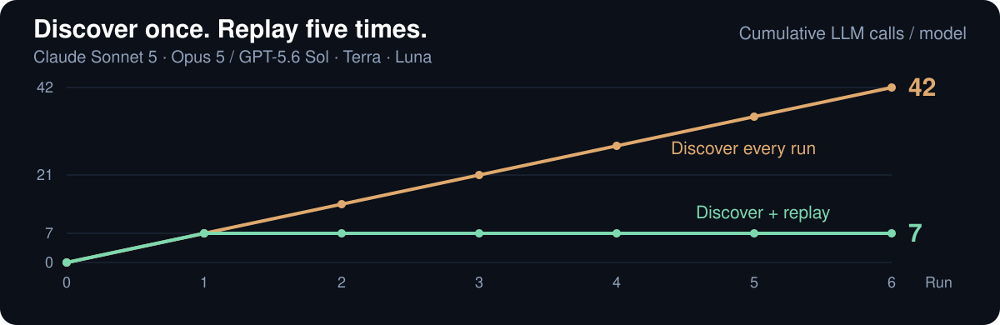

<div align="center">
  
  <p>Discover a browser flow with AI. Save it as a test. Replay without a model; attempt repair when the UI changes.</p>
</div>

# cairn

Agentic-testing engine and CLI for the browser, written in TypeScript.

[](https://www.npmjs.com/package/cairn-engine)
[](https://github.com/team-poem/cairn/actions/workflows/ci.yml)
[](https://www.npmjs.com/package/cairn-engine)
[](LICENSE)

cairn turns a browser task into a reusable JSON test. Use the CLI, or embed `cairn-engine` in your own QA tools with your choice of model and browser driver.

## Where it fits

- **Repeat a browser flow after each change.** Discover a login, form submission or checkout once, save the steps and assertions as `*.skill.json`, then replay them in a regression check.
- **Build your own QA tool.** Embed `cairn-engine` in a CLI, internal agent or browser extension, supplying your own model, driver and application context through public interfaces.

The loop is **discover → freeze → replay → self-heal**. Ordinary replay executes saved steps and mechanical assertions without a model. Healing is opt-in and must pass verification before a repair is saved; an application defect should remain a failure. Review the saved assertions to make sure they check your actual goal, not just arrival at a page. Optional semantic checks require a model and are outside the zero-LLM path.

## See it work

[**Open the order demo →**](https://cairn-order-demo.vercel.app)

Follow one checkout through discovery, zero-call replay, a changed control, verified repair, another zero-call replay, and an order API failure that stays red. Inspect the saved code, browser captures and verdicts, or download the runnable source from the viewer.

The viewer shows **recorded engine executions**, not live model calls. Its interactive shop uses synthetic orders with no payments. The recording uses a preserved 2.9.2 engine build and discloses an evidence-retention limitation in the failure stage; it is not a general repair-success benchmark. [Recording details and reproduction](examples/order-demo).

External newcomer testing has not been completed. The setup below can be checked independently; that does not establish how easy it is for a first-time user.

## Try it locally

Start with the standalone submission fixture: no API key, model account or application setup needed.

You need **Git, npm, Google Chrome, and Node 22.12+** (or Node 20.19+ on the 20.x line). Keep `127.0.0.1:4318` free. The first run needs network access to download the browser adapter; it launches its own isolated headless Chrome.

```sh
git clone --depth 1 https://github.com/team-poem/cairn.git
cp -R cairn/examples/quickstart ./cairn-quickstart
cd cairn-quickstart
npm install
npm run discover:scripted
npm run freeze
npm run replay
```

The copy runs outside the monorepo and installs the published engine from npm. Scripted discovery supplies four fixed responses through the public model interface while **real Chrome** fills and submits the form. This checks the integration, not a model's ability to discover an unfamiliar app.

Expected results:

- `discover:scripted` prints `DISCOVERED: scripted calls=4`.
- `freeze` saves `submit.skill.json`, a readable scenario with steps and assertions.
- `replay` runs it twice in fresh browsers; both print `llmCalls=0; attemptedLlmCalls=0`.

Then try `npm run replay:broken`: the form reaches its success page but its API returns 500. The saved request assertion must fail, with exit code 1 and zero model calls. [Full quickstart and troubleshooting](examples/quickstart).

### Use a model on your own app

Install the CLI with `npm install -g cairn-engine`. Configure one [supported backend](#llm-backends) first; discovery and healing consume model usage.

```sh
# Replace the URL and intent with a flow on your test app.
cairn discover "open the products page" --url=https://your.app --freeze=products.skill.json
cairn replay products.skill.json
# If the UI changes, explicitly allow a repair attempt:
cairn replay products.skill.json --heal
```

Check the saved steps and assertions before treating them as a regression test. For authenticated flows, use [secret placeholders](spec/core/secrets.md), not credentials in the intent. For library usage, install `cairn-engine` locally and follow the [embedding guide](docs/guide.md#embed-it). The [quickstart](examples/quickstart#discover-with-a-real-model-optional) also supports real-model discovery against its local fixture.

## Benchmarks



**One order journey, six runs, the same call counts for all five measured models.** The shared lines show per-model counts, not totals or averages: 42 calls for repeated discovery versus 7 for one discovery and five replays. The rename on run 4 needed no healing. Identical call counts do not imply equal cost or quality, or identical results on other journeys.

[Claude author-reported counts and source](docs/benchmarks/228-claude-calls.json) · [Codex recorded evidence and measurement conditions](docs/benchmarks/228-codex.md). The chart combines existing measurements; no new benchmark was run.

The following cost tables show six runs per journey and approach. These rename-only runs needed no healing; a separate repair measurement follows below.

- **Journey:** The user flow being tested, such as login → cart → order.
- **Discover:** AI performs the task and creates the steps to replay.
- **Replay:** Run the saved steps again without LLM calls.
- **Heal:** AI repairs a step that broke after a UI change, then saves the repair for later runs. See [measured self-heal](#measured-self-heal).

**Claude reported costs**

| Model | Journey | Discover every run | Discover once + replay |
| --- | --- | ---: | ---: |
| Sonnet 5 | Navigation | $0.109 · 18 calls | $0.018 · 3 calls |
| Sonnet 5 | Form save | $0.151 · 24 calls | $0.025 · 4 calls |
| Sonnet 5 | Login → cart → order | $0.269 · 42 calls | $0.046 · 7 calls |
| Opus 5 | Navigation | $0.208 · 18 calls | $0.030 · 3 calls |
| Opus 5 | Form save | $0.255 · 24 calls | $0.042 · 4 calls |
| Opus 5 | Login → cart → order | $0.463 · 42 calls | $0.077 · 7 calls |

**Codex estimated costs**

Codex costs are estimates from recorded tokens assuming OpenAI Standard short-context API rates; the CLI reported neither dollar costs nor a service tier.

| Model | Journey | Discover every run | Discover once + replay |
| --- | --- | ---: | ---: |
| GPT-5.6 Sol | Navigation | ~$0.8002 · 18 calls | ~$0.0880 · 3 calls |
| GPT-5.6 Sol | Form save | ~$0.6905 · 24 calls | ~$0.0826 · 4 calls |
| GPT-5.6 Sol | Login → cart → order | ~$1.1513 · 42 calls | ~$0.1502 · 7 calls |
| GPT-5.6 Terra | Navigation | ~$0.2540 · 18 calls | ~$0.0391 · 3 calls |
| GPT-5.6 Terra | Form save | ~$0.1935 · 24 calls | ~$0.0313 · 4 calls |
| GPT-5.6 Terra | Login → cart → order | ~$0.3788 · 42 calls | ~$0.0566 · 7 calls |
| GPT-5.6 Luna | Navigation | ~$0.0276 · 18 calls | ~$0.0020 · 3 calls |
| GPT-5.6 Luna | Form save | ~$0.0297 · 30 calls | ~$0.0042 · 4 calls |
| GPT-5.6 Luna | Login → cart → order | ~$0.0407 · 42 calls | ~$0.0049 · 7 calls |

## Measured self-heal

In a separate six-run order journey, the **Place order button becomes a link on run 4**. The original test fails without healing. Each model repairs the target with one LLM call, saves the repair, and passes runs 5 and 6 with zero LLM calls.

**Claude reported costs**

| Model | Discovery (run 1) | Repair (run 4) | Replays after repair (runs 5–6) |
| --- | ---: | ---: | ---: |
| Sonnet 5 | $0.042799 · 7 calls | $0.006370 · 1 call | 2/2 pass · 0 calls |
| Opus 5 | $0.087434 · 7 calls | $0.013444 · 1 call | 2/2 pass · 0 calls |

**Codex estimated costs**

| Model | Discovery (run 1) | Repair (run 4) | Replays after repair (runs 5–6) |
| --- | ---: | ---: | ---: |
| GPT-5.6 Sol | ~$0.237219 · 7 calls | ~$0.045860 · 1 call | 2/2 pass · 0 calls |
| GPT-5.6 Terra | ~$0.056860 · 7 calls | ~$0.006834 · 1 call | 2/2 pass · 0 calls |
| GPT-5.6 Luna | ~$0.008757 · 7 calls | ~$0.000582 · 1 call | 2/2 pass · 0 calls |

Claude dollar amounts are provider-reported. Codex amounts are estimates from recorded tokens using OpenAI Standard short-context API rates; the CLI reported neither dollar costs nor a service tier. In this schedule, each model uses **42 calls discovering every run, or 8 discovering once and healing once**. All five repairs succeed and all ten replays after repair use zero calls.

This measures one locator change, with the order verified by the fixture's order count; it does not measure `waitFor` repair or a general repair success rate. [Claude evidence](docs/benchmarks/230-claude.md) · [GPT evidence and reproduction](docs/benchmarks/230-codex.md).

## Features

- Discover a flow from a plain-language intent, with an LLM, once
- Freeze it to a flat, readable, diffable `*.skill.json` file
- Replay it deterministically, with zero LLM calls, and print the proof (`llm: 0 call(s)`)
- Self-heal a broken step from its recorded intent, then re-freeze
- Fill `{name}` secrets at run time, scoped to your site, never frozen into a skill
- Multi-locator targets (accessible name, role and index, CSS) that survive redesigns
- Three-layer judgment: did it act, what it looked like, what the requests and console said
- Run a whole case list with `cairn suite`, with your own success criteria merged in
- Survey an app for UX problems with `cairn explore`, with nothing frozen
- Stream the whole run as a versioned event trace (`TraceSink`, `JsonlTraceSink`)
- Seven replaceable ports: `ContextProvider`, `Planner`, `Driver`, `SkillStore`, `Critic`, `Reporter`, `TraceSink`
- Multiple LLM backends, including key-less Claude Code and Codex CLI
- A browser and extension entry (`cairn-engine/browser`) for environments without Node

## Documentation

| Doc | What it covers |
| --- | --- |
| [`docs/guide.md`](docs/guide.md) | the user guide: CLI, library, suites, explore, skill files, traces, extension points, FAQ |
| [`docs/design.md`](docs/design.md) | the full design, end to end |
| [`spec/core/the-loop.md`](spec/core/the-loop.md) | why discover, freeze, replay, heal |
| [`spec/core/surgical-heal.md`](spec/core/surgical-heal.md) | per-step divergence detection and repair |
| [`spec/core/targeting.md`](spec/core/targeting.md) | multi-locator targets that survive redesigns |
| [`spec/core/judgment.md`](spec/core/judgment.md) | three-layer evidence and deterministic verdicts |
| [`spec/core/trace.md`](spec/core/trace.md) | the versioned trace event contract |
| [`spec/core/secrets.md`](spec/core/secrets.md) | `{name}` secrets: filled at run time, scoped to a site, never frozen |

## LLM backends

Set a key and cairn picks the backend. With no key at all, a local Claude Code install (the default fallback) or the OpenAI Codex CLI both work key-less.

| Backend | How it is selected |
| --- | --- |
| Anthropic | `ANTHROPIC_API_KEY` |
| OpenAI | `OPENAI_API_KEY` |
| Gemini | `GEMINI_API_KEY` |
| Claude Code | local install, no key (default fallback) |
| Codex CLI | local install, reuses your ChatGPT login |

Force one with `createLlmClient({ backend: "codex" })` or the `CAIRN_LLM_BACKEND` env var.

If your model is not supported, implement the `LlmClient` port or open an [issue](https://github.com/team-poem/cairn/issues/new/choose).

## Contributing

cairn takes pull requests. See [`CONTRIBUTING.md`](CONTRIBUTING.md) for the workflow (Conventional Commits, an issue link per PR, the `spec/architecture.md` invariants).

## License

[MIT](LICENSE).
