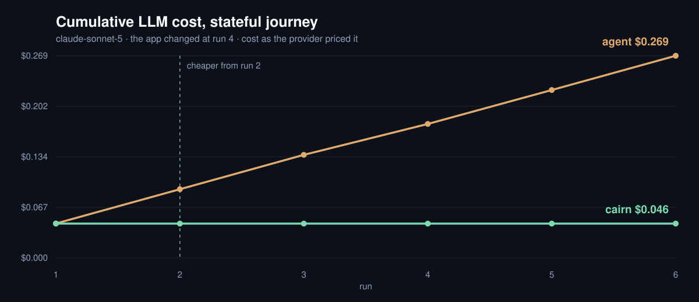

# PR #228 — Codex 5.6 measurement

This measurement compares exploring every time against exploring once and then replaying, on the
same local journey. It is not a benchmark that ranks model quality or estimates the cost of a real service.

## How to read this

Within each model, explore-every-time is compared against explore-once-then-replay. Providers differ
in what their CLI does internally, in which helper models are counted, and in cache conditions, and
equal quality was not verified. So do not use this to divide dollar values between models and build a
general price or quality ranking. Claude's provider-reported amounts and the after-the-fact
unit-price estimates for Codex are presented in separate tables below.

The README splits the call graphs for [Claude](228-claude-calls.svg) and [Codex](228-calls.svg) into a
top and a bottom panel. Both graphs use the same scale based at 0 and show the cumulative calls over
6 runs of the order journey for each arm. Every model in each group goes 42 calls → 7 calls, and these
are not sums or averages across models. For Claude we use the
[cumulative call counts the original author read off the run records and reported](https://github.com/team-poem/cairn/pull/228#issuecomment-5629476331),
[stored together with their source](228-claude-calls.json). For both Sonnet and Opus, explore-every-time
is 7, 14, 21, 28, 35, 42 calls, and explore-then-replay is a cumulative 7 calls in every run. The original
Claude JSON is still gitignored material, and this repository preserves the sequence the author reported.
For Codex we use the per-attempt observed records. For both providers, the confirmed cumulative values
are drawn as dots and solid lines. The [graph rendering script](228-render-calls.mjs) makes no new model
calls and runs with the following command.

```sh
node docs/benchmarks/228-render-calls.mjs
```

## Conditions

- Models: `gpt-5.6-sol`, `gpt-5.6-terra`, `gpt-5.6-luna`. The reasoning level is `medium` for all of them.
- Journeys: navigation, async form save, and login → cart → order.
- 6 runs for each model, journey and arm. 36 runs per model, 108 runs in total.
- Versions: `v1, v1, v1, v2, v2, v2`. Both arms meet the same rename on run 4.
- Document latency `[0, 20]`ms, API latency `[0, 40]`ms, `maxSteps: 20`.
- The journeys, versions, latencies and step limit were kept identical to the Claude configuration in the PR.
- Up to 160 calls per model. This CLI does not report dollar cost, so no spending cap is declared.
- The three models were measured concurrently, but each attempt uses its own server, Chrome profile
  and state. Do not use the elapsed time of this run to compare model speed.

The measurement source is a clean checkout of `ee4dfe3105360e7471ba14c77542177998267dcf`.
Codex CLI `0.146.0`, Chrome `153.0.8010.36`, Node `26.5.1` and Chrome DevTools MCP
`1.8.0` were used. The actual runtime and build hashes, and the per-attempt records, are in the [JSON evidence](228-codex.json).
A prior pilot of the navigation journey and an LLM-free wiring check are not added into this measurement.

## Results

108 of 108 attempts succeeded, and all 45 replays made 0 LLM calls. Token fields were reported for all
300 LLM calls. There were 0 re-frozen repairs. The original report withholds dollar cost, the crossover
point and the charts, and below we add a separate estimate that applies official unit prices to the
observed tokens. The figures below are cumulative over the 6 runs of each arm.

| Model | Journey | Explore every time | Explore once, then replay | Success | Repairs |
| --- | --- | ---: | ---: | ---: | ---: |
| GPT-5.6 Sol | navigation | 211,901 tokens · 18 calls | 35,319 tokens · 3 calls | 12/12 | 0 |
| GPT-5.6 Sol | form | 285,563 tokens · 24 calls | 47,431 tokens · 4 calls | 12/12 | 0 |
| GPT-5.6 Sol | stateful | 506,120 tokens · 42 calls | 84,088 tokens · 7 calls | 12/12 | 0 |
| GPT-5.6 Terra | navigation | 211,858 tokens · 18 calls | 35,310 tokens · 3 calls | 12/12 | 0 |
| GPT-5.6 Terra | form | 285,457 tokens · 24 calls | 47,420 tokens · 4 calls | 12/12 | 0 |
| GPT-5.6 Terra | stateful | 504,711 tokens · 42 calls | 83,956 tokens · 7 calls | 12/12 | 0 |
| GPT-5.6 Luna | navigation | 187,189 tokens · 18 calls | 31,035 tokens · 3 calls | 12/12 | 0 |
| GPT-5.6 Luna | form | 314,858 tokens · 30 calls | 41,760 tokens · 4 calls | 12/12 | 0 |
| GPT-5.6 Luna | stateful | 448,690 tokens · 42 calls | 74,978 tokens · 7 calls | 12/12 | 0 |

Luna's form journey took 30 calls when exploring every time and 4 calls when exploring once. The same
call ratio is not assumed across all models and journeys, and the observed values are shown as they are.
The successes in this run are a result for this fixture and this schedule, and do not mean a general
probability of running without failure.

### Existing Claude measurement

These are the existing figures provided by [PR #228](https://github.com/team-poem/cairn/pull/228). They
were not re-measured in this Codex run, and the original Claude JSON is not included in this evidence.

| Model | Journey | Explore every time | Explore once, then replay |
| --- | --- | ---: | ---: |
| Sonnet 5 | navigation | $0.109 · 18 calls | $0.018 · 3 calls |
| Sonnet 5 | form | $0.151 · 24 calls | $0.025 · 4 calls |
| Sonnet 5 | stateful | $0.269 · 42 calls | $0.046 · 7 calls |
| Opus 5 | navigation | $0.208 · 18 calls | $0.030 · 3 calls |
| Opus 5 | form | $0.255 · 24 calls | $0.042 · 4 calls |
| Opus 5 | stateful | $0.463 · 42 calls | $0.077 · 7 calls |

The Sonnet cost graph from the original PR is preserved as well. It visualises the provider-reported
amounts in the stateful rows of the Claude table above, and it is not a graph that combines those with
the Codex unit-price conversions.



## What the aggregates mean

The call count is the number of times the bench called `complete` on the LLM client. Reconnects inside
the CLI are not counted as separate calls. The CLI runs in an empty temporary directory with user
settings, project instructions, the shell and web tools, and session saving turned off. If the CLI
reports that it switched to a different model, that attempt is not counted as a success for the original model.

The token count is input plus cache read plus cache write plus output. Codex's `input_tokens` includes
cache reads and writes, so both parts are subtracted from plain input, and the reasoning tokens
included in output are not added again. This split follows the [official token accounting example](https://developers.openai.com/cookbook/articles/per_run_spending_controller_responses_api#example-set-a-budget-for-a-support-ticket).
If the CLI omits a field, the total is not marked as complete.

The Codex CLI returned no dollar cost and no service tier in this run. The estimates below do not
change the original `costUsd: null`, nor whether costs can be compared. No point of cost reversal is
given either. Claude's dollar figures come from a separate measurement by the PR author and are the
provider-returned conversion at API list price. Neither provider's figures mean an actual extra charge
on a subscription.

An exploration succeeds when it yields a replayable scenario and reaches the fixture's completion
state. A replay additionally requires the frozen assertions to pass. The failure rates of the two arms
are therefore not measurements of the same judging procedure. Absorbing a simple rename through role
and position is distinct from self-heal, which calls the LLM to repair.
Measuring a repair-only fixture is the scope of [#230](https://github.com/team-poem/cairn/issues/230).

## Dollar conversion — estimate at Standard API unit prices

The Standard, short-context unit prices from the [official OpenAI price list](https://developers.openai.com/api/docs/pricing),
as checked on 2026-09-11, were applied. The CLI did not report a service tier, so Standard is an
assumption made for the calculation. Batch, Flex, Fast, regional surcharges, taxes and individual
contracts are not reflected. The unit is **USD per million tokens**.

| Model | Plain input | Cache read | Cache write | Output |
| --- | ---: | ---: | ---: | ---: |
| GPT-5.6 Sol | $4.00 | $0.40 | $5.00 | $20.00 |
| GPT-5.6 Terra | $2.00 | $0.20 | $2.50 | $12.00 |
| GPT-5.6 Luna | $0.20 | $0.02 | $0.25 | $1.20 |

`estimated USD = (plain input × input price + cache read × read price + cache write × write price + output × output price) / 1,000,000`

Each token item is an observed value that is already separated so the items do not overlap. Cache is
not subtracted again, and reasoning tokens are not added to output. The discounted price was applied
to the cache reads that actually happened, and cache writes were 0 in this run. This is not a
prediction that a separate API run would produce the same cache hit rate.
The largest total input of any single run is 84,672 tokens for Sol, 84,652 for Terra and 75,529 for Luna.
That is an upper bound on the input of an individual request, so all of them are at or below the
short-context threshold of 272,000 tokens.
The source for each model's context threshold is recorded alongside the [price snapshot](228-openai-prices.json).

Below are the **estimates cumulative over the 6 runs of each arm**, on the same basis as the token
table above, rounded to six decimal places.

| Model | Journey | Explore every time, estimated USD | Explore once then replay, estimated USD |
| --- | --- | ---: | ---: |
| GPT-5.6 Sol | navigation | ~$0.800158 | ~$0.088038 |
| GPT-5.6 Sol | form | ~$0.690454 | ~$0.082575 |
| GPT-5.6 Sol | stateful | ~$1.151334 | ~$0.150250 |
| GPT-5.6 Terra | navigation | ~$0.253984 | ~$0.039054 |
| GPT-5.6 Terra | form | ~$0.193528 | ~$0.031278 |
| GPT-5.6 Terra | stateful | ~$0.378848 | ~$0.056556 |
| GPT-5.6 Luna | navigation | ~$0.027633 | ~$0.001991 |
| GPT-5.6 Luna | form | ~$0.029719 | ~$0.004198 |
| GPT-5.6 Luna | stateful | ~$0.040743 | ~$0.004905 |

Summed over the three journeys, the per-model estimates are Sol **$2.641946 → $0.320862**, Terra
**$0.826361 → $0.126888**, and Luna **$0.098095 → $0.011093**.
The sums were computed from the values before rounding.

The [conversion JSON](228-codex-usd.json) preserves the token items and call counts per arm, the
estimates before rounding, and the SHA-256 of the input files. The [conversion script](228-estimate-usd.mjs)
sums in integer nanodollars, and regenerates the same file from the repository root with the following
command, making no new LLM calls.

```sh
node docs/benchmarks/228-estimate-usd.mjs
```

## Re-running

Run from the repository root. Each output directory must be a new path.

```sh
ENGINE_COMMIT=$(git rev-parse HEAD)
npm run bench:local -- cost --config bench/local/cost.gpt-5.6-sol.json --runs 6 \
  --engine-commit "$ENGINE_COMMIT" --out bench/results/codex-sol-new
```

For Terra and Luna, change the config file and the output directory to that model's name.
The config files state the same journeys and schedule. This uses real LLM calls, and the call cap is
not a spending cap. The original `results.json`, the Markdown and the scenarios are saved in the output directory.
The JSON evidence is a subset of the original report, with absolute file paths, stacks and duplicate ledgers removed.
The SHA-256 of the original report and of the config is recorded with it.
